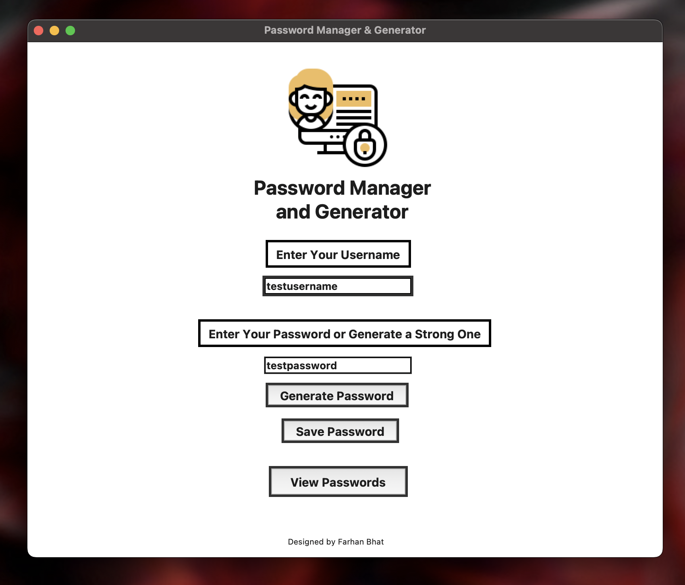
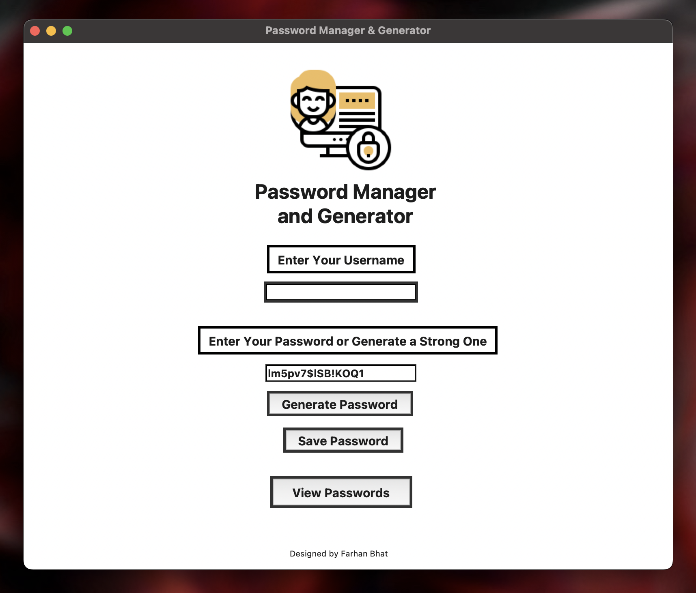
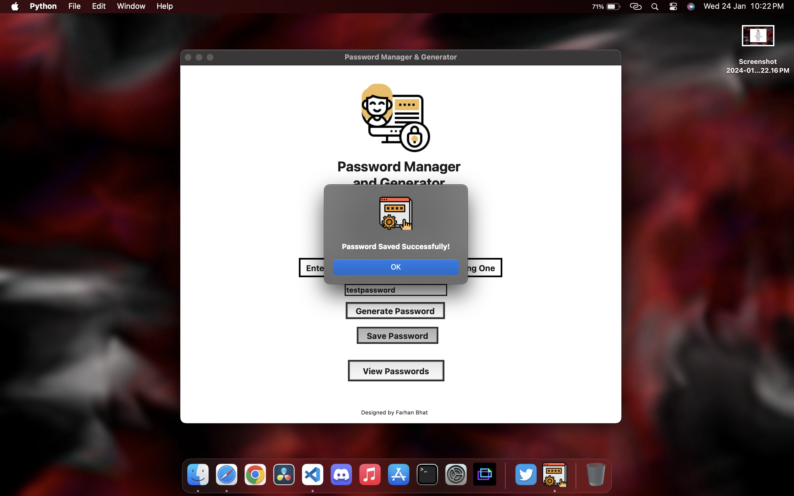
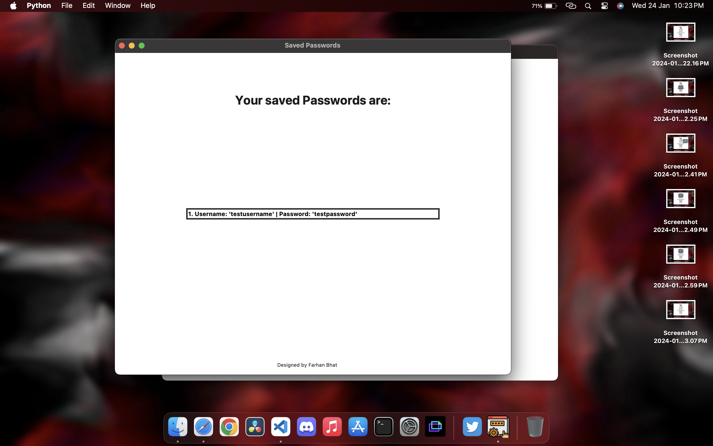
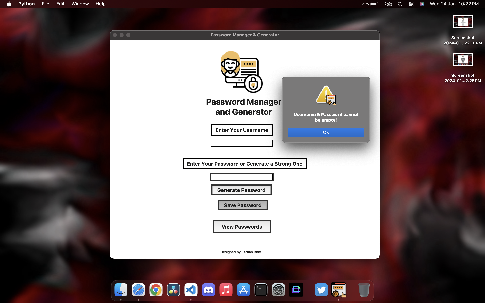
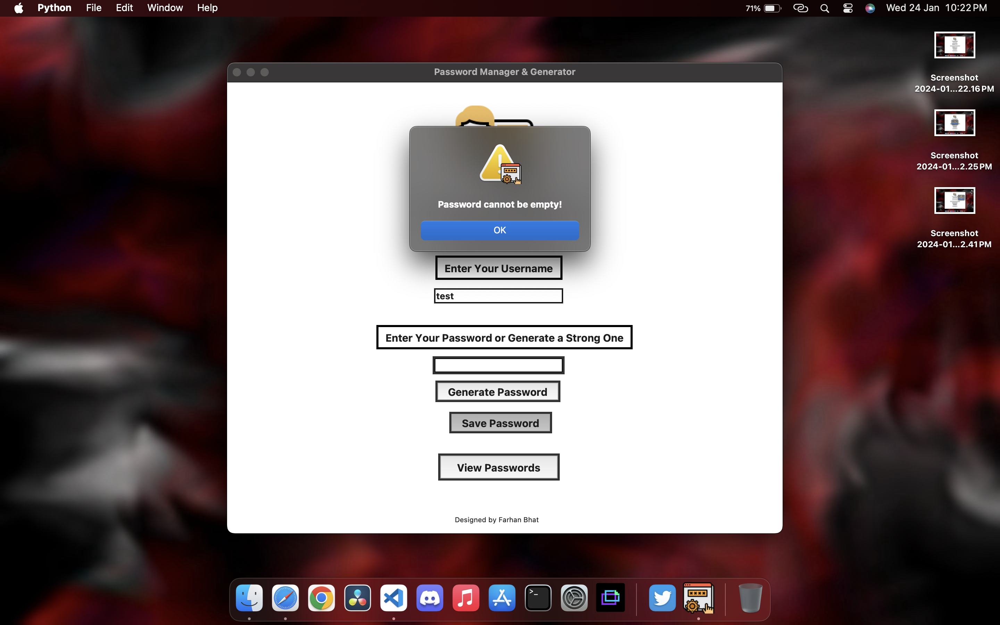
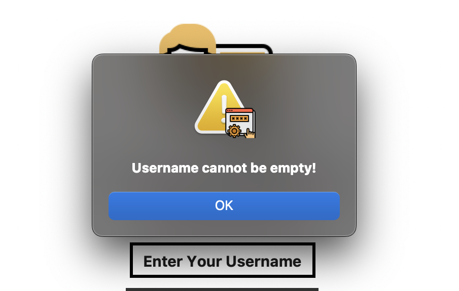

# Password Manager & Generator


## Overview 🚀

A secure and user-friendly Password Manager and Generator built using Tkinter in Python. This application allows users to generate strong passwords and securely store them. It features a clean and intuitive interface for ease of use.



## Table of Contents 📋

- [Features](#features)
- [Screenshots](#screenshots)
- [How to Run](#how-to-run)
- [Contributing](#contributing)
- [License](#license)
- [Acknowledgements](#acknowledgements)

## Features ✨

1. **Password Generation:**

   - Generate strong passwords with a mix of letters, symbols, and numbers.

2. **Password Saving:**

   - Save generated passwords securely in a text file.

3. **View Passwords:**
   - View and manage saved passwords.

## Screenshots 📸

### Home Screen


### Password Generation



### Password Saving



### View Passwords



### Dialog Boxes





## How to Run ▶️

1. **Clone the repository:**

   ```bash
   git clone https://github.com/your-username/your-repo-name.git
   ```

2. **Run the application:**

   ```bash
   python main.py
   ```

## Contributing 🤝

Contributions are welcome! Please follow the [Contributing Guidelines](CONTRIBUTING.md).

## License 📄

This project is licensed under the [MIT License](LICENSE).

## Acknowledgements 🙏

- Icons and Images were downloaded from Flaticon.

---

**Note: Customize the shields, update the placeholders, and add or modify sections based on your project specifics.**
