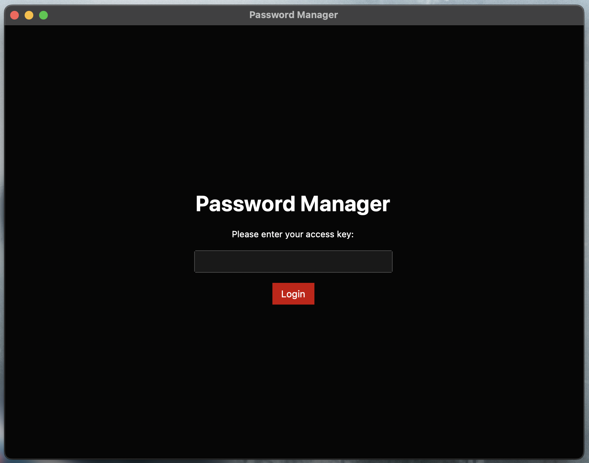
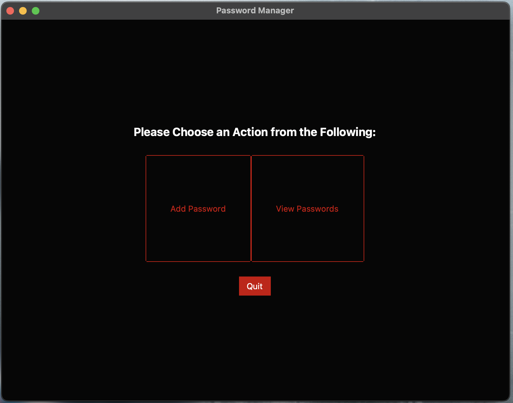
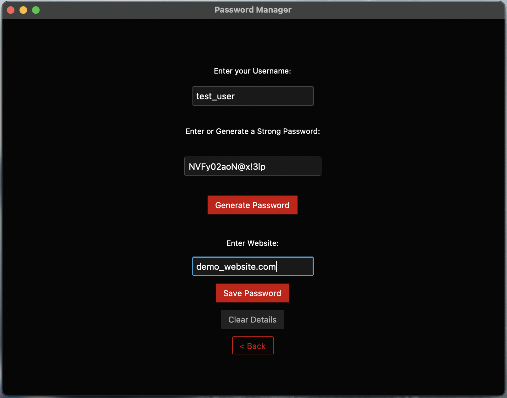
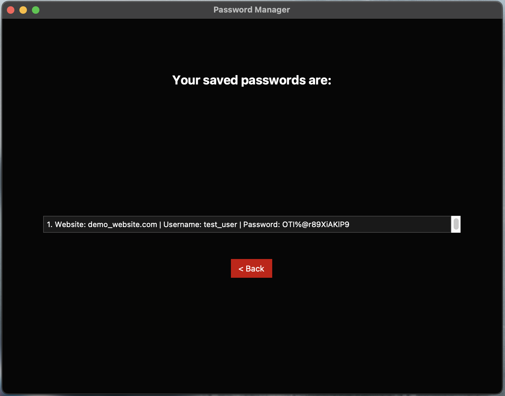

# Password Manager GUI

  
  

## Description

This application is a GUI Password Manager built using Tkinter in Python 3. It allows users to securely store and manage their passwords. More functionality will be added in the future. The project is open to collaboration.

## Features

- **Login**: Users are required to enter an access key to log in, which is changeable through the program itself.
- **Add Password**: Users can add passwords for different websites or applications.
- **View Passwords**: Users can view the passwords they have saved.
- **Generate Strong Passwords**: Option to generate strong passwords.
- **Save Passwords Securely**: Passwords are stored locally on the user's machine so it's less likely to be stolen by anyone.
- **Responsive Design**: The GUI is designed to be fast, responsive and user-friendly.

### Installation & Cloning

1. Clone the repository.

git clone https://github.com/fxrrhxn/Password-Manager.git

2. Install the required dependencies.

pip install ttkbootstrap

3. Run the application.

python3 app.py

## Usage

1. Launch the application.
2. Enter your access key to log in.
3. Choose an action from the available options: Add Password, View Passwords, or Quit.
4. To add a password, click on "Add Password" and follow the instructions.
5. To view saved passwords, click on "View Passwords".
6. To exit the application, click on "Quit".

## Screenshots

## Credits

- [Tkinter](https://docs.python.org/3/library/tkinter.html) - GUI library for Python.
- [ttkbootstrap](https://github.com/TkinterTtk/ttkbootstrap) - Bootstrap-themed widgets for Tkinter.
- Password generation algorithm `pass_generator.py` was created by me.
- This program was created using `Python3`

## License

This project is licensed under the MIT License - see the [LICENSE](LICENSE) file for details.
